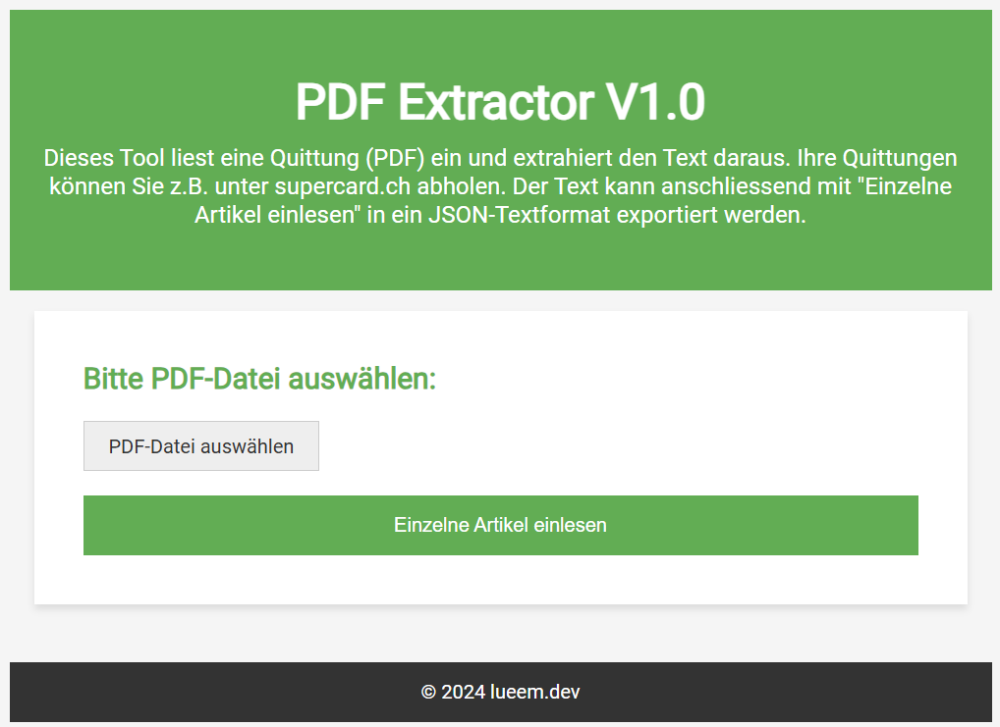

## Quarkus-PDF-Extract Projekt



### pdfbox Übersicht

- Konversion von Dokumenten.
- PDF-Erstellung und Druckausgabe.

### pdfbox Ziele

- Endpunkt für PDF-Empfang.
- Extraktion und Umwandlung von PDF-Zeilen.
- Aufteilung nach Mustern: Artikel, Menge, Preis, Aktion, Total, Zusatz, Datum.

### Dokumentation pdfReader

- Applikationsbetrieb mit Quarkus.
- GUI-Anpassung in "index.html".
- Kategorisierung via ChatGPT
- In "ExtractCoopPosition": Positionsextraktion aus PDFs in "PDF_Documents".
- Lesen und Ausdruck von PDFs im .txt mit PDFBox (PDFLayoutTextStripper).
- Extraktion via PDF-Box

### Starten

```bash
./mvnw compile quarkus:dev
```

### UI Testen

- Öffne <http://localhost:8080/>.
- Wähle Datei in "/PDF_Documents".
- Konvertiere Text mit "Einlesen (alles)".
- Extrahiere Artikel mit "Einlesen (Coop-Artikel)".

## Creating a native executable

You can create a native executable using: 
```shell script
./mvnw package -Dnative
```
